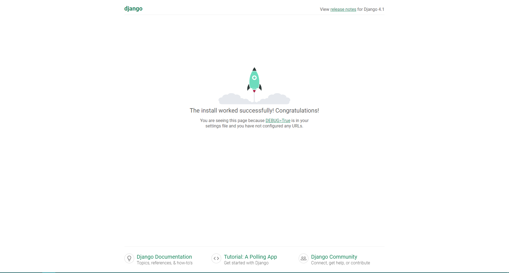

# Que é

Framework web de alto nivel en [[Python]] gratuito e de código aberto. O seu obxectivo e ofrecer un xeito rápido de crear aplicacións web, ofrecendo unha serie de extras de serie para alixeirar a carga de traballo do desenvolvedor como poden ser autentificación de usuarios, mapas do sitio web, feeds RSS... Tamén inclúe funcións de seguridade para evitar ataques como SQL injection, cross-site scripting, cross-site request forgery ou clickjacking.

Por defecto xera unha estrutura [[Model View Controller]]

# Instalación

É necesario ter acceso a *pip* para a instalación. O comando é:

```bash
pip install django
```

# Crear un proxecto

Esta sección emprega un exemplo para explicar o proceso de creación dun proxecto e unha app.  
Para crear un [[#^Proxecto]] é necesario realizar unha configuración inicial, consistente en autoxerar arquivos de código fonte que establezan un proxecto de Django.

En liña de comandos, executar o seguinte comando ca utilidade [[#django-admin]] dende o directorio no que se vai almacenar o proxecto:

```bash
django-admin startproject mysite
```

Isto crea un directorio **mysite** no directorio actual.

**Nota**

> Ao nomear o proxecto, deberán evitarse nomes que coincidan con compoñentes de Python ou Django, como poden ser **django** (entra en conflito con Django) ou **test** (entra en conflito co paquete de probas de Python)

O comando *startproject* creou a seguinte estrutura:

```powershell
mysite
    │   manage.py
    │
    └───mysite
            asgi.py
            settings.py
            urls.py
            wsgi.py
            __init__.py
```

Os seus elementos son:

- O directorio exterior *mysite* é o contedor do proxecto. O nome non é importante para Django; pode ser renomeado.
- [[#^manage]].py, unha utilidade de liña de comandos para interactuar co proxecto concreto.
- O directorio *mysite* interno é o paquete Python para o proxecto. Emprégase o seu nome para importar elementos do paquete dende fora deste.
- *__init__.py*: arquivo baleiro que marca o directorio como paquete para Python. Ver [[Python#Paquetes]].
- *settings.py*: axustes para o proxecto. Ver [[#Axustes de Django]].
- *urls.py*: declaracións de URLs do proxecto. Un índice para o sitio web. Ver [[#URL dispatcher]].
- *asgi.py*: punto de entrada para servidores compatibles con ASGI para servir ao proxecto.
- *wsgi.py*: punto de entrada para servidores compatibles con WSGI para servir ao proxecto.

## Servidor de desenvolvemento

Un dos elementos de Django é o *development server*, un servidor lixeiro escrito en Python cuxo proposito é axilizar o desenvolvemento eliminando a necesidade de configurar un servidor de produción para probar o proxecto.

Utilízase a través da utilidade *manage.py*:

```bash
python manage.py runserver

# saída
#   |
#   v

Performing system checks...

System check identified no issues (0 silenced).

You have unapplied migrations; your app may not work properly until they are applied.
Run 'python manage.py migrate' to apply them.

October 13, 2022 - 15:50:53
Django version 4.1, using settings 'mysite.settings'
Starting development server at [http://127.0.0.1:8000/](http://127.0.0.1:8000/)
Quit the server with CONTROL-C.
```

Accedendo a *localhost:8000* (dirección IP e porto por defecto), verase a páxina "Congratulations!".  



**Nota**

> O porto e a dirección IP para o desenvolvemento poden especificarse como argumentos na liña de comandos.  
> Pode establecerse únicamente o porto:
>
> ```bash
> python mange.py runserver 8080
> ```
>
> Ou a IP e o porto:
>
> ```bash
> python manage.py  runserver 0.0.0.0:8000
> ```

**Nota**

> O servidor de desenvolvemento recarga o código Python con cada petición, co que non é necesario reinicialo ao editar o código fonte. Outras accións como engadir ficheiros si que precisan dun reinicio para ter efecto.

## Crear unha aplicación

Co entorno (proxecto) preparado, pode iniciarse o traballo.

Unha app en Django consiste nun paquete Python que segue unhas certas convencións. Django proporciona unha utilidade para crear a estrutura básica necesaria.

**Nota**

> **Proxectos e apps**
>
> Unha app é unha aplicación web que **fai algo**: un sistema de blog, unha base de datos de rexistros públicos...  
>
> Un proxecto o conxunto das configuracións e apps para un sitio web concreto. Un proxecto pode conter varias apps e unha app pode estar en varios proxectos.

As apps poden estar en calquera lugar do **Python path**. O seguinte exemplo créaa no mesmo directiorio ca *manage.py* para que poida ser importada como o seu propio módulo do nivel superior en lugar de como un submódulo de *mysite*.

Para crear unha app, execútase no directorio no que está *manage.py* o comando:

```bash
python manage.py startapp poll
```

O comando crea un directorio *poll* ca seguinte estrutura que vai conter a unha aplicación:

```powershell
poll
    │   admin.py
    │   apps.py
    │   models.py
    │   tests.py
    │   views.py
    │   __init__.py
    │
    └───migrations
            __init__.py
```

## Escribir unha vista

O arquivo *views.py* contén as vistas da aplicación. Este código de proba xera unha vista o mais sinxela posible:

```python
# poll/views.py

from django.http import HttpResponse

def index(request):
    return HttpResponse("Hello, world. You're at the poll index.")
```

Para chamar a esta vista é necesario mapeala a unha URL, o que require unha URLConf.  
Para creala, créase un arquivo urls.py no directorio *poll*, que vai conter o seguinte código:

```python
# poll/urls.py

from django.urls import path

from . import views

urlpatterns = [
    path('', views.index, name='index')
]
```

O seguinte paso é facer que a URLconf raíz apunte ao módulo *polls.urls*. Isto conséguese importando *django.urls.include* en *mysite/urls.py* e insertando neste arquivo un *include()* na lista *urlpatterns*:

```python
# mysite/urls.py

from django.contrib import admin
from django.urls import include, path

urlpatterns = [
    path('poll/', include('poll.urls')),
    path('admin/', admin.site.urls),
]
```

A función *include()* permite referenciar outras URLconfs. Cando Django atopa un *include()*, corta a parte da URL que coincidiu ata ese punto e envía o resto á URLconf incluída para seguir procesándoo. Isto fai que as URLs poidan ser máis modulares, podendo cambiarse a localización dos recursos sen ter que cambiar a URLconf de nivel superior.

**Nota**

> Sempre debe utilizarse include() ao incluir outros patróns de URL, sendo **admin.site.urls** a única excepción.

A continuación pode comprobarse que a vista responde iniciando o servidor de desenvolvemento e accedendo a *localhost:8000/poll*.

A función *path()* ten catro parámetros. Dous son obrigatorios: a *route* e *view*, e dous son opcionais: *kwargs* e *name*.

- ***route***  
  Cadea que contén un patrón URL. Ao procesar unha petición, Django comeza buscando coincidencias no primeiro patrón na lista *urlpatterns* e continúa ata atopar un patrón compatible.

  Os patróns non buscan parámetros GET e POST ou o nome do dominio. Nunha petición a https://www.example.com/myapp/,  a URLconf buscará a *myapp/*. Nunha petición a https://www.example.com/myapp/?page=3, a URLconf tamén buscará a *myapp/*.
- ***view***  
  Cando Django atopa un patrón coincidente, chama á función de vista especificada cun obxecto *HttpRequest* como primeiro argumento e os valores capturados da ruta como argumentos de palabras clave.  
- ***kwargs***  
  Argumentos arbitrarios de palabras clave que se pasan nun diccionario á vista obxectivo.  
- ***name***  
  Darlle un nome á URL permite referirse a ela de forma unívoca dende calquera lugar en Django. Isto permite realizar cambios aos patróns de URL do proxecto editando un único arquivo.

## Configuración da [[Base de datos]]

# Axustes de Django

# Manexar peticións HTTP

## URL dispatcher

# django-admin

**manage.py**: explicación TODO ^manage

# Glosario

- **Proxecto**  
  Un paquete de Python que contén a configuración para unha instancia de Django: configuración de base de datos, opcións específicas de Django e opcións específicas de aplicación.   ^Proxecto

<!-- 
Fontes:
  docs.djangoproject.com/en/4.1/topics
  docs.djangoproject.com/en/4.1/howto
  docs.djangoproject.com/en/4.1/intro
-->
  