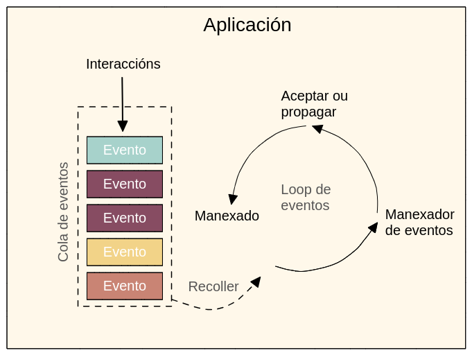
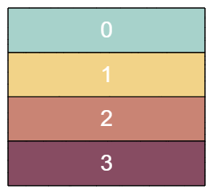
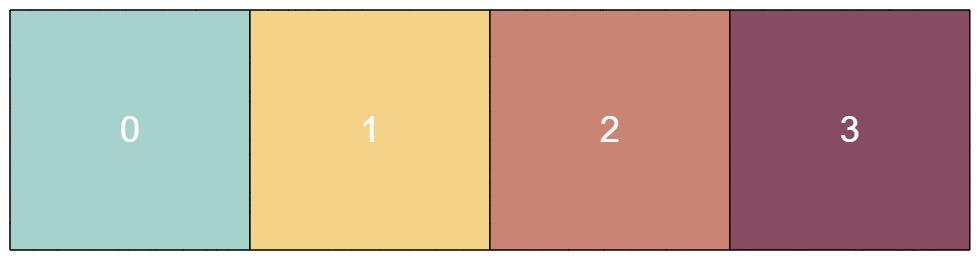
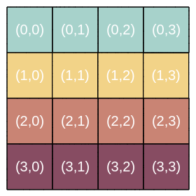
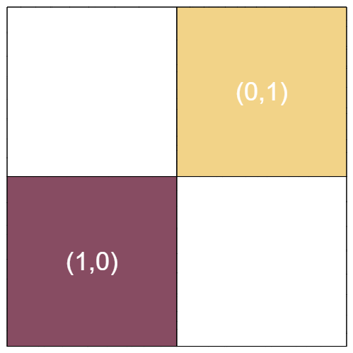
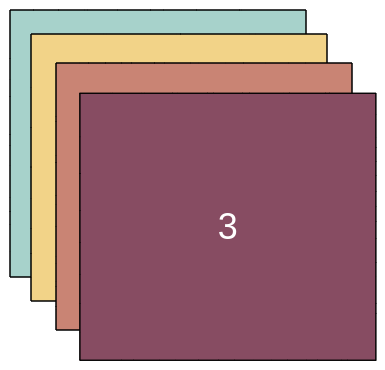
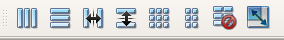

# PyQt6  

## Creación programática de interfaces e fundamentos de Qt  

### Crear unha aplicación  

Unha aplicación Qt necesita de unha única instancia de *QApplication*

```Python
from PyQt6.QtWidgets import QApplication, QWidget
import sys

"""
sys.argv é unha lista cos argumentos de liña de comandos
se os argumentos non son necesarios, pódese crear unha QApplication con []
"""
app = QApplication(sys.argv)

# Este QWidget sera a ventá da aplicación
window = QWidget()
window.show() # Os widgets sen pai están ocultos por defecto

# inicio do loop de eventos
app.exec()

# A aplicación non sae de exec() ata que se peche a súa última ventá aberta e o loop de eventos é detido
```

Os módulos principais de Qt son *QtWidgets*, *QtGui* e *QtCore*.  
No código anterior impórtanse *QApplication*, o manexador de aplicacións, e *QWidget*, un widget básico e baleiro, do módulo *QtWidgets*.

Se non se especifica ningún parámetro, Qt crea unha ventá cas decoracións habituais (icono, título e botóns de minimizar, maximizar e pechar en Windows).  

En Qt, todos os widgets de primeiro nivel son ventás, o que quere dicir que non teñen un pai e non están aniñados noutro widget ou layout.  

#### QMainWindow  

Ainda que calquera widget pode ser unha ventá, Qt proporciona o widget *QMainWindow* para conter elementos gráficos e as funcionalidades esperadas dunha ventá. Entre elas: toolbars, menús, barra de estado ou widgets acoplables. Para crear unha ventá personalizada, crearase unha clase propia que herde de *QMainWindow*, neste caso *MainWindow*:  

```Python
import sys
from PyQt6.QtCore import QSize, Qt
from PyQt6.QtWidgets import QApplication, QMainWindow, QPushButton

class MainWindow(QMainWindow):

    def __init__(self):

        super().__init__()

        self.setWindowTitle('My App')
        button = QPushButton('Press Me!')
        self.setCentralWidget(button) # define o botón como widget central

app = QApplication(sys.argv)

window = MainWindow()
window.show()

app.exec()
```

### O loop de eventos  

O núcleo dunha aplicación Qt é a clase QApplication, que contén o loop de eventos da aplicación. Este xestiona as interaccións do usuario ca GUI.  
Cada interacción (pulsar teclas do teclado, clicks ou movementos do rato...) xera un evento que se introduce na cola de eventos. O loop de eventos consulta periodicamente esta cola e comproba se hai eventos en espera de execución. Se atopa un evento en espera, pasa o control ao manexador de evento correspondente, o cal executa as súas operacións e devolve o control ao loop de eventos.  



### Dimensionar ventás e widgets  

Unha ventá é redimensionable por defecto arrastrando dende as esquinas, pero pode ser que se queira limitar o tamaño dunha ventá a uns valores mínimos e/ou máximos ou eliminar a posibilidade de cambiar o tamaño da ventá.  

En Qt, os tamaños defínense usando un obxecto QSize, o cal toma como argumentos o ancho e o alto (nesa orde) no seu construtor.  

```Python
import sys
from PyQt.QtCore import QSize, Qt
from PyQt6.QtWidgets import QApplication, QMainWindow, QPushButton

class MainWindow(QMainWindow):

    def __init__(self):

        super().__init__()

        self.setWindowTitle('My App')
        
        button = QPushButton('Press Me!')

        self.setFixedSize(QSize(400, 300))

        self.setCentralWidget(button)

app = QApplication(sys.argv)

window = MainWindow()
window.show()

app.exec()
```

Ademáis do método *setFixedSize()*, existen tamén *setMinimumSize()* e *setMaximumSize()*. Estes métodos poden empregarse en **calquera** widget.  

---

### *Signals* e *Slots*  

Un *signal* é unha notificación emitida por un widget cando ocurre un evento. Este sinal é recibido por un *slot*, que pode ser calquera función ou método ao que se lle conecta un sinal. Cando un sinal envía datos, o *slot* correspondente recibirá os mesmos datos. Esta conexión realízase ca función *connect()*. Existen widgets que posúen *slots* predefinidos, co cal poden ser conectados a outros widgets directamente. Varios slots poden recibir información do mesmo sinal.  

Para os seguintes exemplos tómase como base o seguinte código:  

```Python
import sys
from PyQt6.QtWidgets import QApplication, QMainWindow, QPushButton

class MainWindow(QMainWindow):

    def __init__(self):

        super().__init__()

        self.setWindowTitle('My App')

app = QApplication(sys.argv)

window = MainWindow()
window.show()

app.exec()
```

#### **Sinais de QPushButton**  

Para asignar o sinal *clicked* dun botón a un *slot* cread o para a aplicación, conéctase este sinal co método que vai actuar como *slot* (*the_button_was_clicked()* neste caso) no construtor.  

```Python
import sys
from PyQt6.QtWidgets import QApplication, QMainWindow, QPushButton

class MainWindow(QMainWindow):

    def __init__(self):

        super().__init__()

        self.setWindowTitle('My App')

        button = QPushButton('Press Me!')
        button.clicked.connect(self.the_button_was_clicked)

        self.setCentralWidget(button)

    def the_button_was_clicked(self):

        print('Clicked!')

app = QApplication(sys.argv)

window = MainWindow()
window.show()

app.exec()
```  

### Cambiar a interface  

Pode modificarse dinamicamente o estado dos compoñentes dunha interface utilizando *singals* e *slots*. No seguinte exemplo, defínese unha interface cun botón. Ao pulsar o botón, este deshabilítase e cámbiase o seu texto e o título da ventá da aplicación.  

```Python
class MainWindow(QMainWindow):

    def __init__(self):

        super().__init__()

        self.setWindowTitle('My App')

        self.button = QPushButton('Press Me!')
        self.button.clicked.connect(self.the_button_was_clicked)

        self.setCentralWidget(self.button)

    def the_button_was_clicked(self):

        self.button.setText('You already clicked me')
        self.button.setEnabled(False)

        self.setWindowTitle('My Oneshot App')
```

No seguinte exemplo modifícase o título da ventá da aplicación escollendo dunha lista:  

```Python
from PyQt6.QtWidgets import QApplication, QMainWindow, QPushButton
import sys
from random import choice

window_titles = [
    'My App',
    'My App',
    'Still My App',
    'Still My App',
    'What on earth',
    'What on earth',
    'This is surprising',
    'This is surprising',
    'Something went wrong'
]

class MainWindow(QMainWindow):

    def __init__(self):

        super().__init__()

        self.setWindowTitle(window_titles[0])

        self.button = QPushButton('Press Me!')
        self.button.clicked.connect(self.the_button_was_clicked)

        self.windowTitleChanged.connect(self.the_window_title_changed)

        self.setCentralWidget(self.button)

    def the_button_was_clicked(self):

        print('Clicked')
        new_window_title = choice(window_titles)
        print('Setting title: %s' % new_window_title)
        self.setWindowTitle(new_window_title)

    def the_window_title_changed(self, window_title):
        
        print('Window title changed: %s' % window_title)

        if window_title == 'Something went wrong':

            self.button.setDisabled(True)

app = QApplication(sys.argv)

window = MainWindow()
window.show()

app.exec()
```  

Algunhas notas sobre o exemplo:  
O sinal *windowTitleChanged* só cambia cando o título da ventá é substituído por un valor diferente. Se se establece varias veces o mesmo título, o sinal soamente se dispara a primeira vez.  
É posible encadenar diferentes operacións usando sinais. Un click dun botón pode iniciar unha cadea de chamadas de funcións e métodos que non teñen por que coñecer o inicio da cadea.  

### Conectar widgets entre eles directamente  

Os sinais, ademáis de conectarse a métodos definidos polo programador, poden conectarse a métodos dos compoñentes da interface. No seguinte exemplo, recíbese entrada nunha caixa de texto, a cal é trasladada a un *QLabel* mediante o sinal *textChanged*.  

```Python
from PyQt6.QtWidgets import QApplication, QMainWindow, QLabel, QLineEdit, QVBoxLayout, QWidget
import sys


class MainWindow(QMainWindow):

    def __init__(self):

        super().__init__()

        self.setWindowTitle('My App')

        self.label = QLabel()

        self.input = QLineEdit()
        self.input.textChanged.connect(self.label.setText)

        layout = QVBoxLayout()
        layout.addWidget(self.input)
        layout.addWidget(self.label)

        container = QWidget()
        container.setLayout(layout)

        self.setCentralWidget(container)

app = QApplication(sys.argv)

window = MainWindow()
window.show()

app.exec()
```

Para conectar o campo de texto ca label ambos deben estar definidos.  
A maioría de widgets teñen *slots* dispoñibles que poden ser conectados a calquera sinal que emita o tipo que o *slot* acepta. En doc.qt.io pódese consultar a lista de *Public Slots* que posúe cada widget.  

### Eventos  

Chámase evento a unha interacción que o usuario ten ca aplicación. Os distintos tipos de eventos representan un modo distinto de interacción. Os eventos son pasados a manexadores de eventos específicos no momento da interacción.  
Os manexadores de eventos son métodos que poden ser modificados para cambiar a forma en que a aplicación responde ás accións do usuario.  
Un exemplo de evento é o *QMouseEvent*. Instancias deste evento créanse para cada movemento e click sobre un widget. Para este tipo de evento existen varios manexadores:  

- mouseMoveEvent  
- mousePressEvent  
- mouseReleaseEvent  
- mouseDoubleClickEvent  

Clickar sobre un widget provoca que un *QMouseEvent* sexa enviado ao manexador *.mousePressEvent*. Este empregara o obxecto *QMouseEvent* para obter información sobre que sucedeu, como que desencadeou o evento e onde ocorreu.  

```Python
import sys
from PyQt6.QtCore import Qt
from PyQt6.QtWidgets import QApplication, QLabel, QMainWindow, QTextEdit


class MainWindow(QMainWindow):

    def __init__(self):

        super().__init__()
        self.label = QLabel('Click in this window')
        self.setCentralWidget(self.label)

    def mouseMoveEvent(self, e):

        self.label.setText('mouseMoveEvent')

    def mousePressEvent(self, e):

        self.label.setText('MousePressEvent')

    def mouseReleaseEvent(self, e):

        self.label.setText('mouseReleaseEvent')

    def mouseDoubleClickEvent(self, e):

        self.label.setText('mouseDoubleClickEvent')

app = QApplication(sys.argv)

window = MainWindow()
window.show()

app.exec()
```

#### Eventos de rato  

Os eventos de rato en Qt están vixilados mediante o obxecto *QMouseEvent*, que posúe información que se pode consultar sobre o evento mediante métodos:  

- **.button():** O botón específico que iniciou o evento  
- **.buttons():** Estado de todos os botóns do rato  
- **.position():** Posición devolta como un *QPoint*  

Estes métodos poden empregarse dentro dun manexador para responder ou ignorar tipos concretos de evento. No seguinte exemplo, respóndese de distinta maneira a clicks con distintos botóns do rato:  

```Python
def mousePressEvent(self, e):

    if e.button() == Qt.MouseButton.LeftButton:

        self.label.setText('mousePressEvent LEFT')

    elif e.button() == Qt.MouseButton.MiddleButton:

        self.label.setText('mousePressEvent MIDDLE')

    elif e.button() == Qt.MouseButton.RightButton:

        self.label.setText('mousePressEvent RIGHT')

def mouseReleaseEvent(self, e):
    
    if e.button() == Qt.MouseButton.LeftButton:
    
        self.label.setText("mouseReleaseEvent LEFT")

    elif e.button() == Qt.MouseButton.MiddleButton:
    
        self.label.setText("mouseReleaseEvent MIDDLE")

    elif e.button() == Qt.MouseButton.RightButton:
    
        self.label.setText("mouseReleaseEvent RIGHT")

def mouseDoubleClickEvent(self, e):
    
    if e.button() == Qt.MouseButton.LeftButton:
        
        self.label.setText("mouseDoubleClickEvent LEFT")

    elif e.button() == Qt.MouseButton.MiddleButton:
        
        self.label.setText("mouseDoubleClickEvent MIDDLE")

    elif e.button() == Qt.MouseButton.RightButton:
        
        self.label.setText("mouseDoubleClickEvent RIGHT")
```

Os identificadores de botóns defínense no espazo de nomes *Qt* da seguinte forma:  

- *Qt.MouseButton.NoButton*: valor binario 000  
- *Qt.MouseButton.LeftButton*: valor binario 001  
- *Qt.MouseButton.RightButton*: valor binario 010  
- *Qt.MouseButton.MiddleButton*: valor binario 100  

#### **Menús contextuais**  

TODO  

#### **Xerarquía de eventos**  

Usando PyQt, os widgets son parte de dúas xerarquías: a xerarquía de obxectos de Python e a xerarquía de layout de Qt.  

##### **Forwarding con herdanza**

A miúdo pode desexarse capturar un evento e facer algo con el pero tamén executar o comportamento por defecto. Para capturar eventos, sobrescríbense métodos manexadores de eventos, en clases que herdan das proporcionadas polo framework. Por tanto, pódese chamar á implementación defectiva dun método dunha superclase utilizando *super()*. Por exemplo:  

```Python
def mousePressEvent(self, event):

    print('Mouse pressed!')
    super(self, MainWindow).contextMenuEvent(event)
```

O evento prosegue da forma habitual pero cun comportamento intermedio adicional que non causa interferencia.  

##### **Forwarding con layouts**

Ao engadir un widget a unha aplicación, este queda "almacenado" dentro dun elemento pai. Este elemento pode obterse chamando a *.parent()*. En ocasións pódese designar manualmente o elemento pai, como no caso de *QMenu* e *QDialog*.  
Cando un widget xera un evento, é posible que non poida manexalo ou elixa non facelo. Neste caso, os eventos ascenden na xerarquía e os elementos que os reciben poden manexalos ou non ata chegar á ventá principal.  

Ao escribir un manexador de eventos, pódese marcar un evento como manexado chamando a *.accept()*:  

```Python
class CustomButton(QPushButton):

    def mousePressEvent(self, e):

        e.accept()
```

Tamén pode declararse como non manexado chamando a *.ignore()*:

```Python
class CustomButton(QPushButton):

    def mousePressEvent(self, e):

        e.ignore()
```

---

### Widgets  

Un widget é un elemento gráfico co que pode interactuar o usuario. Exemplos de widgets son:  

- *QCheckbox*  
- *QComboBox*  
- *QDateEdit*  
- *QDateTimeEdit*  
- *QDial*  
- *QDoubleSpinbox*  
- *QFontComboBox*  
- *QLCDNumber*  
- *QLabel*  
- *QLineEdit*  
- *QProgressBar*  
- *QPushButton*  
- *QRadioButton*  
- *QSlider*  
- *QSpinBox*  
- *QTimeEdit*  

A lista completa de widgets pode consultarse na documentación.  
Para os seguintes exemplos cos widgets máis comúns tomarase o seguinte código como base:  

```Python
import sys
from PyQt6.QtWidgets import (
    QMainWindow, QApplication,
    QLabel, QCheckBox,
    QComboBox, QListWidget,
    QLineEdit, QSpinBox,
    QDoubleSpinBox, QSlider
)
from PyQt6.QtCore import Qt


class MainWindow(QMainWindow):

    def __init__(self):

        super(MainWindow, self).__init__()

        self.setWindowTitle('My App')

app = QApplication(sys.argv)
w = MainWindow()
w.show()
app.exec()
```

#### ***QLabel***  

Un widget sinxelo que serve para amosar texto. Pódese definir o seu texto ao instancialo:  

```Python
widget = QLabel('Hello')
```

Ou utilizando o método *.setText()*:  

```Python
widget = QLabel('1')
widget.setText('2')
```

Poden axustarse parámetros da fonte como o tamaño ou o aliñamento:  

```Python
class MainWindow(QMainWindow):

    def __init__(self):

        super(MainWindow, self).__init__()

        self.setWindowTitle('My App')

        widget = QLabel('Hello')
        font = widget.font()
        font.setPointSize(30)
        widget.setFont(font)
        widget.setAlignment(Qt.AlignmentFlag.AlignHCenter | Qt.AlignmentFlag.AlignVCenter)

        self.setCentralWidget(widget)
```

É recomendable, ao editar a fonte dun widget, tomar a fonte previa, actualizala con novos valores e reasignala para evitar un cambio de tipografía.  
O aliñamento de texto especifícase empregando flags do espazo de nomes *Qt*:  

**Para aliñamento horizontal:**  

- *Qt.AlignmentFlag.AlignLeft*  
- *Qt.AlignmentFlag.AlignRight*  
- *Qt.AlignmentFlag.AlignHCenter*  
- *Qt.AlignmentFlag.AlignJustify*  

**Para aliñamento vertical:**  

- *Qt.AlignmentFlag.AlignTop*  
- *Qt.AlignmentFlag.AlignBottom*  
- *Qt.AlignmentFlag.AlignVCenter*  

**Atallo para aliñamento vertical e horizontal:**

- *Qt.AlignmentFlag.AlignCenter*

Poden combinarse flags mediante pipes (|) xa que estas son máscaras de bits que non se solapan. *Qt.AlignmentFlag.AlignLeft* ten o valor 0x0001 e *Qt.AlignmentFlag.AlignBottom* ten o valor 0x0040. Ao aplicarlles o OR o valor resultante sería 0x0041, que representa a posición abaixo á esquerda.  

Un *QLabel* tamén pode ser empregado para amosar unha imaxe:  

```Python
widget.setPixmap(QPixmap('img.jpg'))
```

Por defecto, as imaxes conservan as súas proporcións, pero pódese facer que enchan por completo o seu contedor con:  

```Python
widget.setScaledContents(True)
```

#### ***QCheckBox***  

Este widget representa unha caixa que se pode marcar e posúe propiedades configurables para cambiar o seu comportamento.  

```Python
class MainWindow(QMainWindow):

    def __init__(self):

        super(MainWindow, self).__init__()

        self.setWindowTitle('My App')

        widget = QCheckBox()
        widget.setCheckState(Qt.CheckState.Checked)

        widget.stateChanged.connect(self.show_state)

        self.setCentralWidget(widget)

    def show_state(self, s):

        print(s == Qt.CheckState.Checked)
        print(s)
```

É posible especificar o estado da checkbox utilizando *.setChecked(checked: bool)* ou *.setCheckState(state: Qt.CheckState)*  

**Flags para estado de checkbox:**  

- *Qt.CheckState.Unchecked*  
- *Qt.CheckState.PartiallyChecked*  
- *Qt.CheckState.Checked*  

Unha checkbox que permite o estado parcialmente marcada coñécese como "tri-state". Adoita empregarse en disposicións xerárquicas de checkboxes nas que os elementos fillos están enlazados aos pais. Para convertir unha checkbox en tri-state, pódeselle asignar o estado *Qt.CheckState.PartiallyChecked* ou utilizar o método *.setTriState(state: bool)*. As flags de estado son de tipo *int*, polo que poden usarse operadores de comparación con elas.  

#### ***QComboBox***  

TODO

#### ***QListWidget***  

TODO  

#### ***QLineEdit***  

TODO  

#### ***QSpinBox*** e ***QDoubleSpinBox***  

TODO  

#### ***QSlider***  

TODO  

#### ***QDial***  

TODO  

---

### Layouts  

Os layouts serven para determinar como van estar ordenados os compoñentes gráficos dentro do seu contedor. Hai catro layouts básicos en Qt:  

- *QHBoxLayout*
- *QVBoxLayout*
- *QGridLayout*
- *QStackedLayout*

O código base de exemplo será:  

```Python
import sys
from PyQt6.QtWidgets import QApplication, QMainWindow, QWidget
from PyQt6.QtGui import QPalette, QColor


class MainWindow(QMainWindow):

    def __init__(self):

        super(MainWindow, self).__init__()

        self.setWindowTitle('MyApp')

app = QApplication(sys.argv)
window = MainWindow()
window.show()
app.exec()
```

Para visualizar os exemplos, empregarase o seguinte widget que amosa unha cor sólida:  

```Python
class Color(QWidget):

    def __init__(self, color):

        super(Color, self).__init__()
        self.setAutoFillBackground(True)

        palette = self.palette()
        palette.setColor(QPalett.ColorRole.Window, QColor(color))
        self.setPalette(palette)
```

#### **QVBoxLayout**  

Este layout coloca os widgets uns enriba de outros linealmente. Ao engadir un widget, este engádese pola parte inferior.  



Neste exemplo, vese como o layout sitúa os elementos:  

```Python
from PyQt6.QtWidgets import QApplication, QMainWindow, QWidget, QVBoxLayout
from PyQt6.QtGui import QPalette, QColor


class Color(QWidget):

    def __init__(self, color):

        super(Color, self).__init__()
        self.setAutoFillBackground(True)

        palette = self.palette()
        palette.setColor(QPalette.ColorRole.Window, QColor(color))
        self.setPalette(palette)


class MainWindow(QMainWindow):

    def __init__(self):

        super(MainWindow, self).__init__()

        self.setWindowTitle('My App')

        layout = QVBoxLayout()

        layout.addWidget(Color('red'))
        layout.addWidget(Color('green'))
        layout.addWidget(Color('blue'))

        widget = QWidget()
        widget.setLayout(layout)
        self.setCentralWidget(widget)

app = QApplication([])
window = MainWindow()
window.show()
app.exec()
```  

#### **QHBoxLayout**  

Igual ao anterior, pero organiza os ítems horizontalmente, engadindo os novos pola dereita.  



Para comprobar o funcionamento, pode substituírse o *QVBoxLayout* do exemplo anterior por un *QHBoxLayout*.  

#### **QGridLayout**  

Aínda que é posible empregar combinacións de *QVBoxLayout* e *QHBoxLayout* para crear distribucións de elementos máis complexas, se o que se desexa é que elementos de distintos tamaños queden aliñados, deberíase empregar un *QGridLayout*. Este layout organiza os contidos nunha cuadrícula, especificando para cada widget unha fila e unha columna para colocalos.  



Non é necesario encher consecutivamente todas as posicións da cuadrícula, o que permite máis liberdade ao crear distribucións.  



#### **QStackedLayout**  

Este layout apila os widgets uns fronte a outros, sendo utilizable só o widget visible no nivel superior. É útil para imitar unha interface con lapelas. Existe un widget, *QStackedWidget*, que é un contedor que funciona da mesma forma que este layout, sendo util cando se desexa engadir unha pila de widgets directamente a unha *QMainWindow* con *.setCentralWidget()*.  

  

Pódese controlar o widget visible en cada momento empregando os métodos *.setCurrentIndex(i: int)* e *setCurrentWidget(widget: QWidget)*.  

O seguinte exemplo emprega o *QStackedLayout* e *QButton* para crear unha interface con lapelas:  

```Python
import sys
from PyQt6.QtCore import Qt
from PyQt6.QtWidgets import (
    QApplication,
    QHBoxLayout,
    QLabel,
    QMainWindow,
    QPushButton,
    QStackedLayout,
    QVBoxLayout,
    QWidget
)
from PyQt6.QtGui import QPalette, QColor


class Color(QWidget):

    def __init__(self, color):

        super(Color, self).__init__()
        self.setAutoFillBackground(True)

        palette = self.palette()
        palette.setColor(QPalette.ColorRole.Window, QColor(color))
        self.setPalette(palette)


class MainWindow(QMainWindow):

    def __init__(self):

        super().__init__()

        self.setWindowTitle('My App')

        page_layout = QVBoxLayout()
        button_layout = QHBoxLayout()
        self.stack_layout = QStackedLayout()

        page_layout.addLayout(button_layout)
        page_layout.addLayout(self.stack_layout)

        btn = QPushButton('red')
        btn.pressed.connect(self.activate_tab_1)
        button_layout.addWidget(btn)
        self.stack_layout.addWidget(Color('red'))

        btn = QPushButton('green')
        btn.pressed.connect(self.activate_tab_2)
        button_layout.addWidget(btn)
        self.stack_layout.addWidget(Color('green'))

        btn = QPushButton('yellow')
        btn.pressed.connect(self.activate_tab_3)
        button_layout.addWidget(btn)
        self.stack_layout.addWidget(Color('yellow'))

        widget = QWidget()
        widget.setLayout(page_layout)
        self.setCentralWidget(widget)


    def activate_tab_1(self):

        self.stack_layout.setCurrentIndex(0)

    def activate_tab_2(self):

        self.stack_layout.setCurrentIndex(1)

    def activate_tab_3(self):

        self.stack_layout.setCurrentIndex(2)

app = QApplication(sys.argv)
window = MainWindow()
window.show()
app.exec()
```

De todos modos, Qt proporciona un widget predefinido (*QTabWidget*) que ten este comportamento por defecto pero en forma de widget. O seguinte código recrea o resultado do anterior con *QTabWidget* cambiando as lapelas a vertical e permitindo cambialas de sitio:  

```Python
import sys

from PyQt6.QtWidgets import (
    QApplication,
    QMainWindow,
    QTabWidget,
)

from layout_colorwidget import Color


class MainWindow(QMainWindow):
    def __init__(self):
        super().__init__()

        self.setWindowTitle("My App")

        tabs = QTabWidget()
        tabs.setTabPosition(QTabWidget.TabPosition.West)
        tabs.setMovable(True)

        for n, color in enumerate(["red", "green", "blue", "yellow"]):
            tabs.addTab(Color(color), color)

        self.setCentralWidget(tabs)


app = QApplication(sys.argv)

window = MainWindow()
window.show()

app.exec()
```

Esta forma de construir interfaces con lapelas é máis sinxela e tamén mais flexible, podendo modificar algúns parámetros de forma máis inmediata.  

---

### **Toolbars**  

Son barras de iconos e texto empregadas para realizar accións concretas dentro da aplicación e así reducir o uso de menús complexos. Este é o codigo inicial para os próximos exemplos:  

```Python
import sys
from PyQt6.QtWidgets import (
    QMainWindow,
    QApplication,
    QLabel,
    QToolBar,
    QStatusBar
)
from PyQt6.QtGui import QAction, QIcon
from PyQt6.QtCore import Qt


class MainWindow(QMainWindow):

    def __init__(self):

        super(MainWindow, self).__init__()

        self.setWindowTitle('My App')

app = QApplication(sys.argv)
w = MainWindow()
w.show()
app.exec()
```

#### **Engadir unha toolbar**  

En Qt, as toolbars están representadas pola clase QToolBar. Para engadir unha a unha aplicación, chámase a *.addToolbar()* na *QMainWindow*. Para identificala, pásase como argumento ao construtor un *str* que será o seu nome:  

```Python
class MainWindow(QMainWindow):

    def __init__(self):

        super(MainWindow, self).__init__()

        self.setWindowTitle('My app')

        label = QLabel('Hello!')
        label.setAlignment(Qt.AlignmentFlag.AlignCenter)

        self.setCentralWidget(label)

        toolbar = QToolBar('My main toolbar')
        self.addToolBar(toolbar)

    def onMyToolBarButtonClick(self, s):

        print('click', s)
```

Para engadir funcionalidade á toolbar, utilizarase a clase *QAction*. Esta clase permite describir interfaces de usuario abstractas. Isto quere dicir definir múltiples elementos dentro dun único obxecto unidos polo efecto que ten interactuar con eles. Un exemplo sería un editor de texto no que a acción de cortar sexa accesible mediante a barra de menú (Edit>Cut), unha toolbar e o atallo de teclado *Ctrl-X*.  

Definindo un só obxecto *QAction* e engadíndoo ao menú e a toolbar evítanse duplicidades no código. Unha *QAction* posúe nomes, mensaxes de estado, iconos, sinais dispoñibles para conectar e outros elementos.  

No código de exemplo amósase como engadir unha *QAction*:  

```Python
class MainWindow(QMainWindow):

    def __init__(self):

        super(MainWindow, self).__init__()

        self.setWindowTitle('My App')

        label = QLabel('Hello!')
        label.setAlignment(Qt.AlignmentFlag.AlignCenter)

        self.setCentralWidget(label)

        toolbar = QToolBar('My main toolbar')
        self.addToolBar(toolbar)

        buton_action = QAction('Your button', self)
        button_action.setStatusTip('This is your button')
        button_action.triggered.connect(self.onMyToolBarButtonClick)

    def onMyToolBarButtonClick(self, s):

        print('click', s)
```

Ao definir unha *QAction*, o elemento pai pásase como último argumento. Neste caso sería *self*.  

A continuación engádese unha barra de estado representada por *QStatusBar*. Esta amosará o texto definido con *.setStatusTip()* ao pasar o rato por enriba dun elemento.  

```Python
class MainWindow(QMainWindow):

    def __init__(self):

        super(MainWindow, self).__init__()

        self.setWindowTitle('My App')

        label = QLabel('Hello!')
        label.setAlignment(Qt.AlignmentFlag.AlignCenter)

        self.setCentralWidget(label)

        toolbar = QToolBar('My main toolbar')
        self.addToolBar(toolbar)

        button_action = QAction('Your button', self)
        button_action.setStatusTip('This is your button')
        button_action.triggered.connect(self.onMyToolBarButtonClick)
        toolbar.addAction(button_action)

        self.setStatusBar(QStatusBar(self))

    def onMyToolBarButtonClick(self, s):

        print('click', s)
```

Para convertir a *QAction* nun interruptor que cambie de estado ao clickalo, simplemente chámase ao método *.setCheckable(True)*. O parámetro *s* en *onMyToolBarButtonClick(self, s)* é o sinal que representa o estado *checked* cun *bool*. Existe tamén un sinal *.toggled* co mesmo efecto.  

Pódese engadir un icono á *QAction* pasándoo como primeiro parámetro ao construtor na instanciación. O icono está representado por un obxecto *QIcon* e, para evitar un exceso de padding, deberá explicitarse o tamaño dos icono co método *.setIconSize()* de *QToolBar*. Este acepta un obxecto *QSized* que representa as dimensións do obxecto.  

```Python
class MainWindow(QMainWindow):

    def __init__(self):

        super(MainWindow, self).__init__()

        self.setWindowTitle('My App')

        label = QLabel('Hello!')
        label.setAlignment(Qt.AlignmentFlag.AlignCenter)

        self.setCentralWidget(label)

        toolbar = QToolBar('My main toolbar')
        toolbar.setIconsSize(QSize(16, 16))
        self.addToolBar(toolbar)

        button_action = QAction(QIcon('img.png'), 'Your button', self)
        button_action.setStatusTip('This is your button')
        button_action.triggered.connect(self.onMyToolBarButtonClick)
        button_action.setCheckable(True)
        toolbar.addAction(button_action)

        self.setStatusBar(QStatusBar(self))

    def onMyToolBarButtonClick(self, s):

        print('click', s)
```

Para determinar o aspecto do botón, utilizaranse as flags do espazo de nomes *Qt* xunto co *slot* *.setToolButtonStyle()*. As flags son:  

- *Qt.ToolButtonIconOnly*
- *Qt.ToolButtonTextOnly*
- *Qt.ToolButtonTextBesideIcon*
- *Qt.ToolButtonTextUnderIcon*
- *Qt.ToolButtonFollowStyle*

Por defecto o estilo é *Qt.ToolButtonFollowStyle*, que usa a opción que determine o sistema operativo.  

### Menús  

TODO  

---

### Diálogos  

TODO  

#### **QMessageBox**

TODO  

#### **Diálogos predefinidos de QMessageBox**  

TODO  

---

### Crear unha nova ventá

TODO  

### Amosar e ocultar unha ventá  

TODO  

### Ventás persistentes  

TODO  

#### **Amosar e ocultar ventás persistentes**

TODO

### Múltiples ventás  

TODO  

## Utilizando QtDesigner  

### Engadir un layout  

No panel dereito amósase a *QMainWindow* e os seus elementos descendentes. O primeiro, *centralwidget*, representa ao widget principal da ventá. O icono que o acompaña representa o layout que emprega actualmente. Inicialmente, o icono é un círculo cruzado vermello, indicando que non se aplica ningún layout.  

Cun click dereito sobre *QMainWindow*, pódese engadir un layout con *Lay out>\[tipo de layout\]*. O layout seleccionado aplícase ao *centralwidget* da *QMainWindow* e os elementos descendentes colócanse de acordo co tipo de layout.  

### Uso do arquivo .ui  

QtDesigner garda os deseños ca extensión .ui en formato XML. Para utilizar estes arquivos en Python existen dúas opcións:  

- Cargar o arquivo nunha clase utilizando o método *.loadUI()*  
- Convertir o arquivo a código fonte Python con pyuic6  

#### Cargar o arquivo directamente  

Emprégase o módulo *uic* incluído en PyQt6. O método *uic.loadUI()* toma como parámetro o nome do arquivo .ui que contén o deseño e crea un obxecto con el.  

```Python
import sys
from PyQt6 import QtWidgets, uic

app = QtWidgets.QApplication(sys.argv)

window = uic.loadUi("mainwindow.ui")
window.show()
app.exec()
```

#### Convertir o arqivo a código fonte  

Utilízase a ferramenta *pyuic6* dende a liña de comandos:  

```BASH
pyuic mainwindow.ui -o MainWindow.py
```

O arquivo creado desta forma non debería ser editado manualmente, xa que na próxima conversión perderanse os cambios.  
O ficheiro .py resultante impórtase en Python de forma normal, tendo en conta que *pyuic6* toma o nome do obxecto definido no ficheiro .ui e engádelle o prefixo *Ui_* tras a conversión a Python. Se o elemento era *MainWindow*, en Python traballarase co obxecto *Ui_MainWindow*.  

Para crear a ventá na aplicación, créase unha clase que herda de *QMainWindow* e a clase *Ui_MainWindow* importada. No construtor chámase a *self.setupUi(self)* para inicializar a interface.  

```Python
import sys
from PyQt6 import QtWidgets, uic
from MainWindow import Ui_MainWindow

class MainWindow(QtWidgets.QMainWindow, Ui_MainWindow):

    def __init__(self, *args, obj = None, **kwargs):

        super(MainWindow, self).__init__(*args, **kwargs):
        self.setupUi(self)

app = QtWidgets.QApplication(sys.argv)

window = MainWindow()
window.show()
app.exec()
```

### Engadir lóxica de aplicación  

Funciona do mesmo xeito que ao crear os elementos con código. A ferramenta *pyuic6* engade os widgets empregando o nome que recibiron en QtDesigner.  

---

### Utilizar layouts con QtDesigner  

A forma recomendada para incluír widgets dentro de layouts en QtDesigner é arrastrar os widgets á ventá de aplicación, seleccionalos e despois aplicarlles o layout adecuado.  
Poden aplicarse layouts a través da toolbar de QtDesigner para evitar o uso de menús.  



De esquerda a dereita representan:  

- Layout horizontal (*QHBoxLayout*)
- Layout vertical (*QVBoxLayout*)
- Layout horizontal con splitter: permite redistribuir o peso de cada elemento  
- Layout vertical con splitter: igual ca o horizontal  
- Layout en cuadrícula (*QGridLayout*)
- Layout de formulario: ordena os elementos en dúas columnas, a primeira habitualmente para etiquetas e para pedir información e a segunda para widgets de entrada ou mostra de datos.  
- Romper layout: desfai un layout. Isto permite volver a editar manualmente os compoñentes.  
- Axustar tamaño: axusta o tamaño do layout para acomodar os widgets que contén e asegurar que cada un ten espazo suficiente para ser visible.  

Pode accederse a estas opcións mediante o menú *Form*

## Cheat Sheet  

mucho TODO

### *Signals*  

**Sinais de QPushButton:**  

- clicked  
- checked  
- released  

**Sinais de QMainWindow:**  

- windowTitleChanged  

